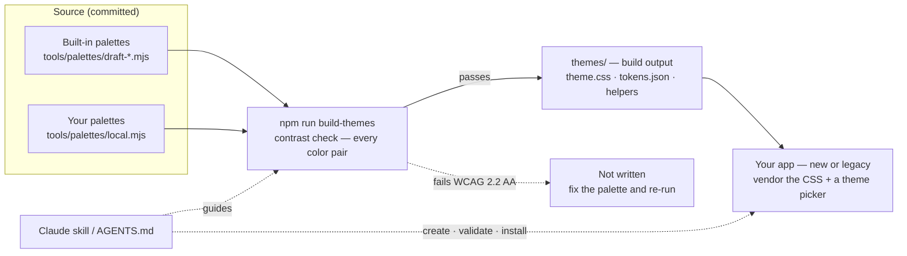
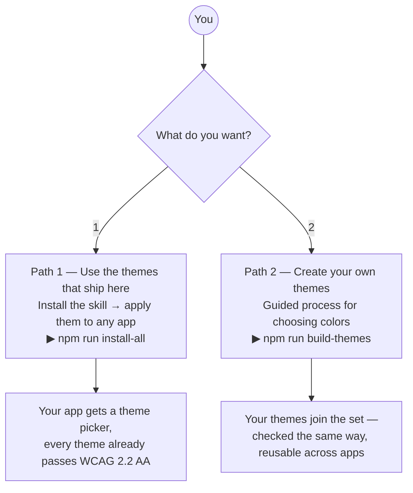
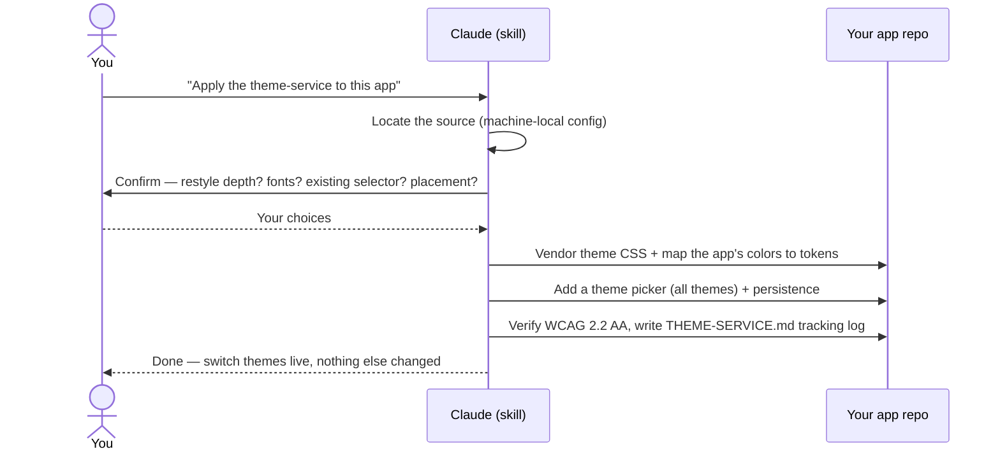
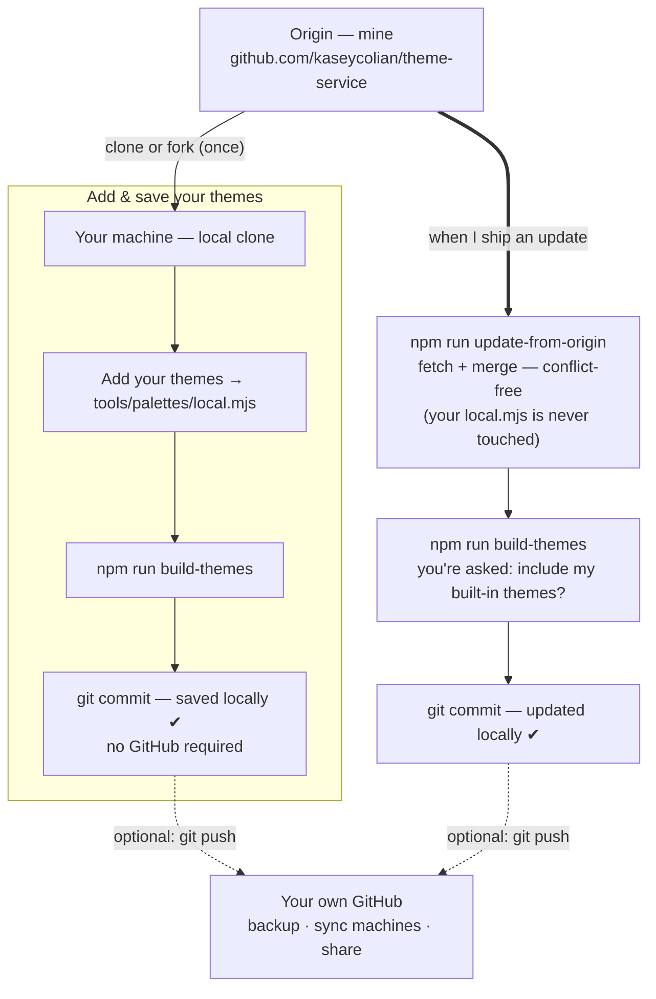
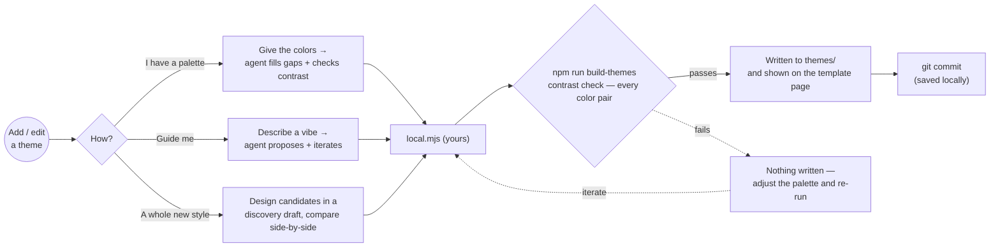
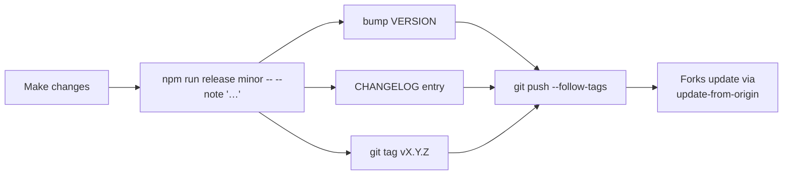

# Theme Service — Visual Overview

A tour of what this service is, how you work with it, and the workflows you'll hit. The diagrams
below render as graphics on GitHub; the same diagrams, live and themed, are on
[overview.html](overview.html).

🌐 **Live:** the overview is the repo's [GitHub Pages home](https://kaseycolian.github.io/theme-service/);
the **Preview Themes** nav segment opens the
[template page](https://kaseycolian.github.io/theme-service/preview/), which shows every theme in real
components.

---

## What it is

Create WCAG 2.2 compliant themes, then install them into a new or existing app. Use the themes that
ship here, or use the skill (`AGENTS.md` for other agents) to create your own — a guided process for
choosing colors that checks contrast as it goes. **A theme that fails WCAG 2.2 AA is never written.**

**What you get:** accessibility handled up front — every color pair is checked before a theme exists.
On top of that: consistent branding across *all* your apps, driven by plain-English requests to an
agent, works fully offline, and it's **yours** — fork it, add themes, and keep pulling upstream
improvements without losing your work.

---

## Two ways in

You never have to create a theme to get value — Path 1 stands alone. Both paths are contrast-checked
the same way.

| Path | Who it's for | Start here |
|------|--------------|-----------|
| **1 — Use as-is** | Anyone who wants accessible theming fast | `npm run install-all`, then ask an agent to apply it |
| **2 — Create / edit** | You want your own brand themes | [CREATING-THEMES.md](../CREATING-THEMES.md) |

---

## Workflow A — Install themes into a new or existing app

You ask; the agent does the wiring and confirms the choices that matter before changing anything.

Later: *"Update this app to the latest theme-service version"* re-syncs it — new themes show up in the
picker automatically.

---

## Workflow B — Clone / save / update, with your own local + GitHub storage

This is the heart of "make it your own." **Your themes live on your machine and persist with a plain
local commit — GitHub is optional.** You can still pull my updates anytime without losing your themes.

- **Solid arrows = what you do locally.** Everything works with just local git.
- **Dotted arrows = optional GitHub** — only if you want backup, multi-machine sync, or to share.
- **Updates never overwrite your themes.** Your themes sit in `local.mjs`, which the origin never
  edits; the generated `themes/` files aren't committed, so merges don't conflict. During an update
  you choose whether to also take my built-in themes — and **nothing is ever auto-deleted**.

Storage at a glance:

| Where | What lives there | Committed? |
|-------|------------------|-----------|
| **Your machine** (local git) | your clone + `local.mjs` themes + your commits | yes (local) |
| **Your GitHub** (optional) | a pushed copy for backup / sharing | only if you push |
| **Origin — mine** | the built-in themes, skill, tools you pull updates from | yes (public) |
| **`~/.claude/…local.json`** | which repo is *your* source + your install/update history | **never** (machine-only) |

---

## Workflow C — Create or edit a theme

Three ways to start. All of them end at the same contrast check, and a palette only becomes a theme if
it passes.

Full walkthrough + copy-paste prompts: [CREATING-THEMES.md](../CREATING-THEMES.md).

---

## Workflow D — Releasing (origin owner)

When the owner changes themes/skill/tools, one command cuts a versioned, tagged release that forks
can pull.

---

## Key terms

- **Source repo** — the theme-service clone your machine points at (where themes are created/edited).
  Apps only get *copies*.
- **Built-in themes** — the origin's pre-installed set (`tools/palettes/draft-*.mjs`).
- **`local.mjs`** — *your* themes; the origin never touches it, so updates never lose them.
- **Build output** — `themes/theme.css` and friends: generated by `npm run build-themes`, not
  committed (so forks update cleanly).
- **Vendored copy** — the theme files an app keeps for itself after you apply the service.
- **Tracking log** — `THEME-SERVICE.md` written into each themed app: version + decisions + history.
- **Machine-local config** — `~/.claude/theme-service.local.json`: your source pointer, built-ins
  preference, and install/update history. Never committed.

---

*See also:* [README](../README.md) · [USAGE](../USAGE.md) (apply) ·
[CREATING-THEMES](../CREATING-THEMES.md) (create) · [ARCHITECTURE](../ARCHITECTURE.md) (how it fits).
