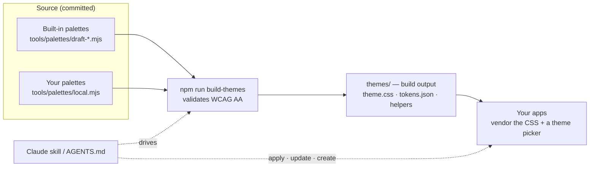
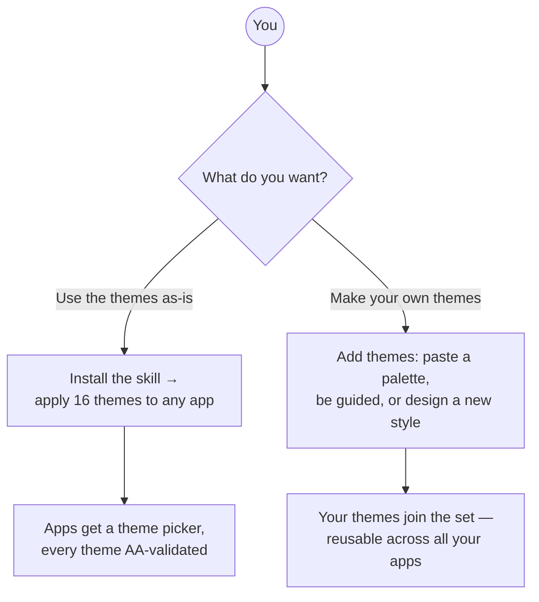
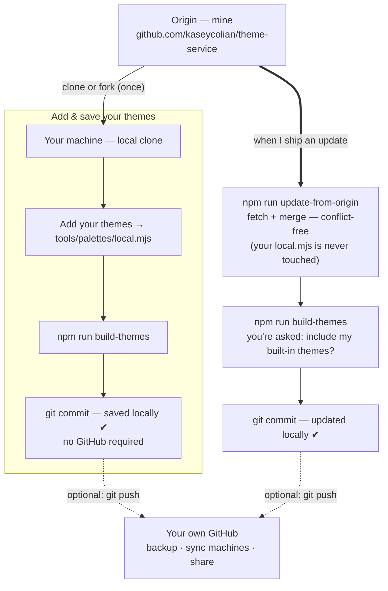
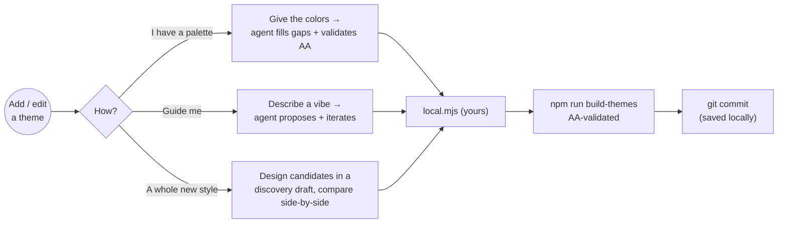
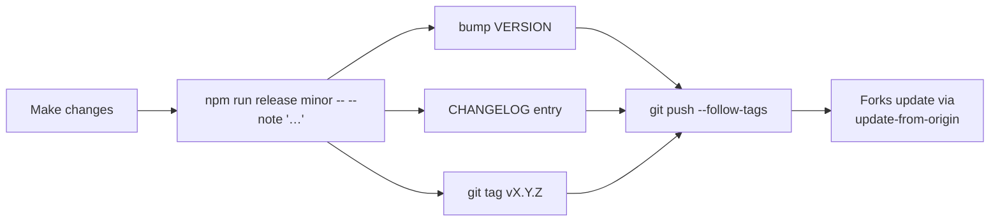

# Theme Service — Visual Overview

A human-friendly tour of what this service is, how you work with it, and the workflows you'll hit.
The diagrams below render as graphics on GitHub. *(First-pass diagrams — the content is what we're
nailing down; a polished graphic version comes next.)*

---

## What it is (in one picture)

One consistent "90s skating rink" neon look — **16 themes, dark + light, all WCAG AA 2.2** — that any
agent can drop into any app, and that **you** can extend with your own themes. Plain CSS custom
properties: no framework lock-in, no build step for the apps that consume it.



**Why it's powerful:** consistent branding across *all* your apps, accessibility guaranteed, driven
by plain-English requests to an agent, works fully offline, and it's **yours** — fork it, add themes,
and keep pulling upstream improvements without losing your work.

---

## Who uses it, and the two ways in

You never have to touch theme creation to get value — Path 1 stands alone.



| Path | Who it's for | Start here |
|------|--------------|-----------|
| **1 — Use as-is** | Anyone who wants consistent theming fast | `npm run install-all`, then ask an agent to apply it |
| **2 — Create / edit** | You want your own brand themes | [CREATING-THEMES.md](../CREATING-THEMES.md) |

---

## Workflow A — Apply the themes to an app

You ask; the agent does the wiring and confirms the choices that matter before changing anything.

```mermaid
sequenceDiagram
  actor You
  participant Agent as Claude (skill)
  participant App as Your app repo
  You->>Agent: "Apply the theme-service to this app"
  Agent->>Agent: Locate the source (machine-local config)
  Agent->>You: Confirm — restyle depth? fonts? existing selector? placement?
  You-->>Agent: Your choices
  Agent->>App: Vendor theme CSS + map the app's colors to tokens
  Agent->>App: Add a theme picker (all themes) + persistence
  Agent->>App: Verify WCAG AA, write THEME-SERVICE.md tracking log
  Agent-->>You: Done — switch themes live; nothing else changed
```

Later: *"Update this app to the latest theme-service version"* re-syncs it — new themes show up in the
picker automatically.

---

## Workflow B — Clone / save / update, with your own local + GitHub storage

This is the heart of "make it your own." **Your themes live on your machine and persist with a plain
local commit — GitHub is optional.** You can still pull my updates anytime without losing your themes.



- **Solid arrows = what you do locally.** Everything works with just local git.
- **Dotted arrows = optional GitHub** — only if you want backup, multi-machine sync, or to share.
- **Updates never overwrite your themes.** Your themes sit in `local.mjs`, which the origin never
  edits; the generated `themes/` files aren't committed, so merges don't conflict. During an update
  you choose whether to also take my built-in themes — and **nothing is ever auto-deleted**.

Storage at a glance:

| Where | What lives there | Committed? |
|-------|------------------|-----------|
| **Your machine** (local git) | your clone + `local.mjs` themes + your commits | yes (local) |
| **Your GitHub** (optional) | a pushed copy for backup / sharing | only if you push |
| **Origin — mine** | the built-in themes, skill, tools you pull updates from | yes (public) |
| **`~/.claude/…local.json`** | which repo is *your* source + your install/update history | **never** (machine-only) |

---

## Workflow C — Create or edit a theme

Three on-ramps, one destination: a validated palette that becomes a reusable theme.



Full walkthrough + copy-paste prompts: [CREATING-THEMES.md](../CREATING-THEMES.md).

---

## Workflow D — Releasing (origin owner)

When the owner changes themes/skill/tools, one command cuts a versioned, tagged release that forks
can pull.



---

## Key terms

- **Source repo** — the theme-service clone your machine points at (where themes are created/edited).
  Apps only get *copies*.
- **Built-in themes** — the origin's pre-installed set (`tools/palettes/draft-*.mjs`).
- **`local.mjs`** — *your* themes; the origin never touches it, so updates never lose them.
- **Build output** — `themes/theme.css` and friends: generated by `npm run build-themes`, not
  committed (so forks update cleanly).
- **Vendored copy** — the theme files an app keeps for itself after you apply the service.
- **Tracking log** — `THEME-SERVICE.md` written into each themed app: version + decisions + history.
- **Machine-local config** — `~/.claude/theme-service.local.json`: your source pointer, built-ins
  preference, and install/update history. Never committed.

---

*See also:* [README](../README.md) · [USAGE](../USAGE.md) (apply) ·
[CREATING-THEMES](../CREATING-THEMES.md) (create) · [ARCHITECTURE](../ARCHITECTURE.md) (how it fits).
